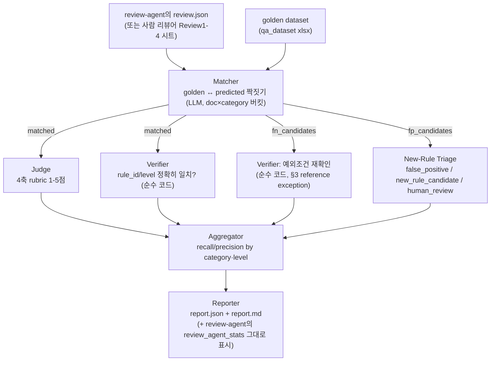

# planqa-eval-agent

PlanQA 프로젝트의 **평가 에이전트** — 룰북 기반 기획서 품질 검토 에이전트(`review-agent/`, 별도
폴더/브랜치)의 출력을 사람이 라벨링한 골든 데이터셋과 대조해 recall/precision을 재고, 그 채점
자체(4축 rubric, FP triage)도 LLM-as-judge 오케스트레이션으로 신뢰도를 올립니다.

## 아키텍처



- **Parser** (`parsers/`) — golden dataset(xlsx), Review1-6 사람 리뷰어 시트, review-agent의
  `review.json`을 전부 공통 `Issue` 스키마로 정규화. 문서 목록/룰 목록을 코드에 하드코딩하지
  않고 매번 파일에서 새로 읽음 (`rulebook.py`, `parsers/golden.py`).
- **Matcher** (`matcher.py`) — `(doc_id, rule category)`로 버킷을 나눠 그 안에서만 LLM에게
  golden↔predicted N:M 매칭을 시킴 (범위를 좁혀서 정확도/비용 둘 다 개선).
- **Verifier** (`verifier.py`) — 매칭된 쌍은 rule_id/level이 정확히 같은지 순수 코드로 비교하고,
  안 잡힌 golden 이슈(fn_candidates)는 룰북 §3 참조-예외 조건(인용문+플래그된 문구가 같은 문단에
  있는지)을 다시 검사 — 이 단계는 LLM을 안 씀.
- **Judge** (`judge.py`) — 매칭된 쌍의 설명 품질을 4축(root_cause_accuracy/no_hallucination/
  service_tone_fit/actionability, 1-5점)으로 채점. 기본은 LLM 1개(`judge_matches`, 배치 1콜 +
  개별 폴백), `--judge-ensemble`을 주면 `judge_matches_ensemble`로 전환.
- **New-Rule Triage** (`new_rule_triage.py`) — 매칭 안 된 predicted 이슈(fp_candidates)를
  false_positive/new_rule_candidate/human_review로 분류. Judge와 똑같이 단일-LLM 기본 +
  `--judge-ensemble`로 앙상블 전환 가능.
- **LLM-as-judge 오케스트레이션** (`ensemble.py`, `--judge-ensemble`) —
  `microsoft/llm-as-judge`의 SuperJudge/Mediator 구조를 참고: 앙상블로 지정한 sLLM 여러 개(예:
  로컬 qwen2.5/exaone3.5/gemma2)가 같은 항목을 각자 채점 → 평균/다수결로 합침. 점수 표준편차가
  임계치를 넘거나(judge) 합의 비율이 2/3 미만이면(triage) `ambiguous=True`로 표시하고, arbiter
  LLM(보통 `--backend`로 고른 모델)이 그 항목만 한 번 더 단독 판정 — 값싼 로컬 모델로 대부분을
  처리하고, 진짜 갈리는 소수만 강모델을 부른다.
- **Aggregator** (`aggregator.py`) — recall/precision을 카테고리·Level별로 집계 (excused miss/
  new-rule candidate/human-review는 precision 계산에서 제외), Review1-4 사람 베이스라인과 비교.
- **Reporter** (`reporter.py`) — `report.json`/`report.md` 생성. review-agent가 이미 측정해
  `review.json`에 실어 보낸 시간/토큰 비용(`stats`)을 eval-agent가 새로 재지 않고 그대로
  `review_agent_stats`에 얹어서 recall/precision 옆에 보여줌.

전체는 `planqa_eval.pipeline.run_pipeline()` 한 함수로 묶여 있고, review-agent의 실제 출력이든
사람 리뷰어 시트든 전부 이 함수 하나를 거쳐서 Aggregator가 사과 대 사과로 비교할 수 있게 함.
LLM 백엔드는 `llm/factory.py`가 `gemini`/`ollama` 중 골라 만들어주는 팩토리 패턴이라, Matcher/
Judge/Triage/앙상블 멤버/arbiter 전부 같은 인터페이스(`LLMClient.complete_json`)로 섞어 쓸 수
있음.

## 데이터

- `data/rulebook/` — 검토 룰북 (8개 카테고리, 41개 룰, 문서 위계·예외조건 정의)
- `data/qa_dataset/` — golden dataset(현재 38문서/131건, 계속 늘어남) + Documents 마스터(41개) +
  사람 리뷰어 6명(Review1-6, 현재 1-4만 작성됨) 시트
- `data/source_documents/` — golden dataset이 참조하는 원문 기획서 40건 (DOC-000은 원본이 빈
  파일이라 없음 — `docs/progress.md` 2026-08-05 항목 참고)
- `data/sample_review_output.json` — 구 golden dataset 기준 합성 예시. 매칭 있는 케이스를
  포함하고 있어 (Judge/앙상블 경로를 실제로 태워보는 용도로 유용) recall/precision 수치 자체는
  참고하지 마세요.
- `data/review_agent_sample_output.json` — review-agent가 **실제로** 낸 첫 출력(DOC-001, 6건).

## 설치

```bash
uv sync
```

## LLM 백엔드 설정

`.env.example`을 복사해서 `.env`를 만들고 값을 채웁니다.

```bash
cp .env.example .env
```

- `PLANQA_LLM_BACKEND` — `gemini`(기본) 또는 `ollama`(로컬)
- Gemini 무료 티어는 하루 요청 한도가 낮습니다(모델/키마다 다르지만 하루 20회 수준도 있음 —
  이 세션에서도 실제로 다 써서 429를 봤음). 여러 키를 콤마로 묶어 `GEMINI_API_KEYS`에 넣으면 한
  키가 quota에 걸릴 때마다 자동으로 다음 키로 넘어가며 씁니다 (`GEMINI_API_KEY` 단일 키도 계속
  지원). Gemini가 불안정하거나(503 등) 쿼터가 다 찼으면 `--backend ollama`로 바로 전환 가능.
- Ollama를 쓰려면 로컬에 [Ollama](https://ollama.com)를 설치하고 모델을 pull해둬야 합니다:
  ```bash
  brew install ollama
  brew services start ollama
  ollama pull qwen2.5:1.5b     # 기본 모델
  ollama pull exaone3.5:2.4b   # 앙상블 저지용 (한국어 특화, Qwen과 다른 학습 계열)
  ollama pull gemma2:2b        # 앙상블 저지용 (또 다른 계열)
  ```

## 사용법

```bash
# 기본: 단일 LLM으로 Matcher/Judge/Triage 전부 처리
uv run planqa-eval evaluate --predictions data/sample_review_output.json

# LLM-as-judge 오케스트레이션: 4축 rubric 채점/FP triage를 로컬 sLLM 3개 합의로 (갈리면
# --backend의 모델이 arbiter로 재판정)
uv run planqa-eval evaluate --predictions data/sample_review_output.json \
  --judge-ensemble qwen:ollama:qwen2.5:1.5b,exaone:ollama:exaone3.5:2.4b,gemma:ollama:gemma2:2b

# 로컬 전용으로 (Gemini 불안정/쿼터 소진 시)
uv run planqa-eval evaluate --predictions data/sample_review_output.json --backend ollama
```

`--predictions`에는 review-agent의 JSON 출력을 넣습니다 (기대 스키마는
`docs/adr/0001-review-agent-output-contract.md` 참고, `{"stats": {...}}`가 같이 있으면 리포트에
비용도 얹힘). `uv run planqa-eval --help` / `evaluate --help`로 전체 옵션 확인 가능.

review-agent(`feature/review-agent` 브랜치, `review-agent/` 폴더)로 직접 새 출력을 만들려면:

```bash
cd review-agent && uv run planqa-review review --input <기획서.md> --doc-id DOC-001
# → outputs/review/gemini_lite/<timestamp>/review.json 을 여기 --predictions에 그대로 넣으면 됨
```

## 테스트

```bash
uv run pytest
```

## 실제로 냈던 결과

**review-agent가 실제로 도는지 (2026-08-07)** — `feature/review-agent`를 pull해서 자체 테스트
84/84 통과 확인 후, 실제 Gemini API로 DOC-001을 검토 실행: **30건 지적, 363초**, 스키마도
`parse_review_output`이 그대로 읽음.

**그 실제 출력의 정량평가** — recall/precision **0%/0%** (TP=0, FN=131, FP=1). 버그 아님 —
골든셋의 실제 DOC-001 이슈는 `LG-05`인데 이 실행의 예측은 전부 `AE-03`/`TC-02` 카테고리라 애초에
안 겹침 (단일 문서 커버리지 갭. 여러 문서에 대해 돌려야 의미 있는 recall/precision이 나옴 —
2026-08-05 세션에서 합성 샘플로도 같은 현상 확인된 적 있음).

**LLM-as-judge 앙상블 라이브 실행 (2026-08-07/08, 전부 로컬 qwen/exaone/gemma, Gemini 0콜)**
- `judge_match_ensemble`: `data/sample_review_output.json`의 실제 매칭 쌍 **18/18 채점 완료,
  8건 `ambiguous=True`**(3모델 점수 표준편차>1.0), 10건은 합의.
- `triage_ensemble`: FP 후보 6건 전부 3-way로 갈려(`ambiguous=True`) Gemini arbiter로
  에스컬레이션 성공.

**qwen 배치 JSON 크래시 → 수정 확인 (2026-08-08)** — Review1(56건)을 `qwen2.5:1.5b`로 돌리면
큰 배치 JSON을 못 만들어 전체가 죽던 문제를, 배치 실패 시 항목별 개별 호출로 자동 폴백하도록
고침. 같은 Review1 데이터로 재실행해 **judge 25건 + triage 31건, 크래시 없이 완료** 확인.

**참고(2026-08-02, 구버전 파이프라인 기준)** — 당시 합성 19건 샘플로 Gemini 89.5%(18/19),
Ollama qwen2.5:1.5b 84.2% recall/precision 확인. DOC-006처럼 같은 위치에 골든 이슈 2개
(AE-01/AE-03)가 겹치는 애매한 매칭에서 Ollama가 Gemini보다 약한 모습을 보였는데 — 이런 모델별
신뢰도 차이를 잡아내는 게 지금의 `--judge-ensemble`이 하는 일입니다 (메모리:
planqa-model-selection-policy).

자세한 작업 이력(세션별 타임라인, 설계 결정 배경, 실패했던 시도들)은 `docs/progress.md`, 설계
결정은 `docs/adr/`를 참고하세요.
