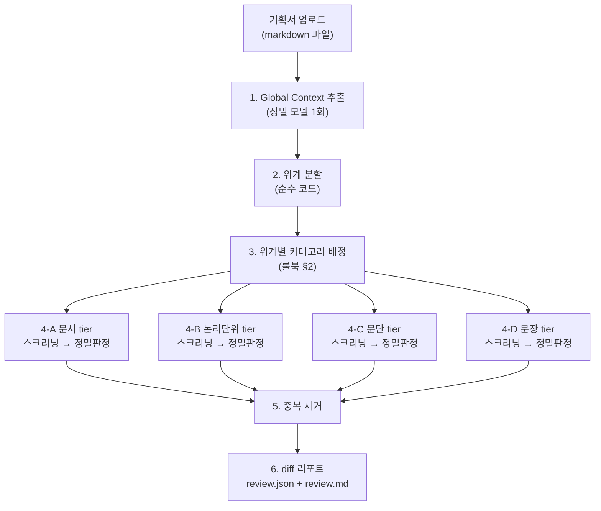

# 기획서 검토 에이전트 (`planqa-review`) 아키텍처

> 상태: 초안(v1). 사용자가 기획서(markdown)를 넣으면 `data/rulebook/rulebook_v1.0.md`
> 룰북 기준으로 검토하고, 결과를 **원문 vs 제안 diff** 형태로 보여준다.
>
> 이 저장소(`planqa-eval-agent`)는 검토 에이전트(`review-agent/`, 이 폴더)와 평가 에이전트
> (`eval-agent/`, 별도 폴더 — `feature/eval-agent` 브랜치 소유, 이쪽에서 손대지 않음)를 각자
> 독립된 최상위 폴더로 같이 관리하는 모노레포다. 두 폴더는 서로 다른 `pyproject.toml`/패키지
> (`planqa_review` vs `planqa_eval`)를 갖는 완전히 독립된 프로젝트로, 코드 공유는 하지 않는다
> (필요한 공통 로직은 이쪽에 독립적으로 복사해서 들고 있음 — 아래 "eval-agent와의 관계" 참고).

## 왜 이렇게 만들었나

멘토링 노트(`0730 멘토링...md`)에서 두 가지가 이미 승인된 방향으로 나왔고, 이 구현은 그대로
따른다.

1. **2단계(저비용 스크리닝 → 고비용 정밀판정) 구조** — "방안 2 프로세스 예시" 이미지가 보여준
   방식. 토큰 가성비와 실시간성을 동시에 잡으려면 넓게/싸게 의심 구간을 넓게 잡아내고, 좁혀진
   구간만 비싼 모델로 정밀 판정하는 게 낫다는 멘토 코멘트("방식2가 효율성이 높아 보임")를
   반영했다.
2. **Global Context → Target Selection → Parallel Execution → Result Collect & Dedupe**의
   4단계 오케스트레이션 — "전체 흐름을 검토받고 싶다"는 질문에 대한 답으로 나온 구조. 여기서는
   Target Selection이 룰북 §1의 문서 위계(문서/논리단위/문단/문장) 분할이고, Parallel
   Execution이 위계별 스크리닝→정밀판정, Dedupe가 5단계다.

## 6단계 파이프라인



### 1. Global Context Extraction — [`context.py`](../src/planqa_review/models/gemini_lite/context.py)

문서 전체를 정밀 모델에 1번 보내 목적·핵심 정책을 압축 요약한다. 이 요약은 이후 모든
스크리닝/정밀판정 프롬프트 앞에 붙는다 — 매 호출마다 문서 전체를 다시 첨부하지 않아도 GA(상위
목표 정합성) 판단 등이 문맥을 잃지 않게 하기 위해서다("여러 AI 세션 간 맥락 유지"에 대한
멘토링 노트의 조언과 같은 취지).

### 2. 위계 분할 — [`document.py`](../src/planqa_review/document.py)

룰북 §1 정의를 그대로 코드로 옮긴다.

| 위계 | 분할 기준 |
|---|---|
| 문서 | 파일 전체 1개 청크 |
| 논리단위 | `## ` (H2) 제목 경계 |
| 문단 | 논리단위 안의 `### ` 이상(H3+) 제목 경계. 하위 제목이 없으면 논리단위 전체가 문단 1개 |
| 문장 | 문단을 다시 분리 — 불릿 한 줄, 표의 행 한 줄, 마침표 기준 프로즈 문장을 각각 1 단위로 취급 (§1: "표의 셀 1개, 불릿 1개도 문장으로 본다" — v1은 셀 단위 대신 행 단위로 근사) |

`data/source_documents/DOC-001_*.md`의 실제 구조(`## 6. 프로덕트 기능` → `### 홈 화면 구성
요소` → `#### 6-1. 메인 배너`)로 검증했다.

### 3. 위계별 카테고리 배정 — [`tiers.py`](../src/planqa_review/tiers.py)

> **⚠️ TODO — 이 섹션은 구버전(40룰) §2 기준이라 지금 룰북과 안 맞음.** 2026-08-05에
> `rulebook_v1.0.md`가 40룰→41룰로 크게 개편되면서(§2 위계표 전면 재구성, §3 예외조건 대상
> 변경, "부재 확인형(Absence Check)" 룰 개념 신규 추가 등) 아래 표와 `tiers.py`의
> `TIER_CATEGORIES`가 최신 §2 내용을 반영하지 못하고 있다. 이 재설계는 다음에 진행할 "여러
> 파이프라인 구조 실험"(병렬처리/멀티에이전트/단일에이전트+Tool/검토용 Tool 분리)과 같이 하기로
> 하고 지금은 손대지 않았다 — **이 문서와 `tiers.py`를 그대로 신뢰하지 말 것.** 최신 §2는
> `data/rulebook/rulebook_v1.0.md`를 직접 확인.

룰북 §2 "카테고리별 검토 위계" 표를 상수로 옮겼다(구버전 기준, 위 TODO 참고).

| 위계 | 카테고리 |
|---|---|
| 문서 | 논리비약, 논리흐름, 용어및단어일관성, 정보누락, 불필요한중복, 상위목표세부내용정합성 |
| 논리단위 | 논리비약, 논리흐름, 용어오용, 모호한표현, 정보누락 |
| 문단 | 용어오용, 정보누락 |
| 문장 | 용어오용, 모호한표현 |
| 단어 | (§2 표에 미기재 — 아래 "알려진 제약" 참고) |

이 표는 코드로 하드코딩했다. §2 원문이 Notion 내보내기 특성상 표 셀 안에 개행이 들어간
비표준 마크다운이라(`카테고리` 셀 하나에 "① 논리 비약\n② 논리 흐름\n..."처럼 여러 줄이 들어감)
정규식으로 안정적으로 파싱하기 어렵다고 처음엔 판단해서 하드코딩했는데, eval-agent 쪽
`rulebook.py`가 이 문제를 `_repair_wrapped_table_rows()`(줄바꿈으로 끊긴 표 행을 파싱 전에
한 줄로 합침)로 이미 해결해뒀다(이 저장소가 그 최신 `rulebook.py`를 그대로 들여왔다 — 아래
"eval-agent와의 관계" 참고). 그러니 다음 재설계 때는 하드코딩 대신 §2를 실제로 파싱하는 쪽이
더 낫다 — 룰북이 바뀔 때마다 수동으로 표를 옮겨 적다 틀리는 지금 방식의 근본 원인이 해소된다.

### 4. 위계별 2단계 검토 — [`screener.py`](../src/planqa_review/models/gemini_lite/screener.py) / [`confirmer.py`](../src/planqa_review/models/gemini_lite/confirmer.py)

위계마다 **스크리닝 1회 배치 호출 → 정밀판정 1회 배치 호출**을 수행한다. `matcher.py`/
`judge.py`가 이미 쓰고 있는 "인덱스 태그 배치 + 배치 응답에서 인덱스가 빠지면 조용히 스킵"
패턴을 그대로 따랐다(평가 에이전트 쪽 코드와 스타일을 맞춤).

- **스크리닝(저비용 모델)**: 해당 위계의 청크 전체 + 배정된 카테고리의 룰 한 줄 요약 +
  Global Context → recall 우선으로 넓게 후보를 나열한다.
  `{chunk_index, rule_id, quoted_text, reason}`
- **정밀판정(고비용 모델)**: 후보마다 룰 전문 + 예외조건 + 청크 전체 원문 + Global Context →
  엄격하게 재검증한다. `{violated, original_text(근거문장), description(위반내용),
  rationale(근거), fix_direction(개선안), excused, excuse_reason}`

**예외조건(§3)은 LLM 자기 판단을 믿지 않는다.** §3이 지정한 참조-예외 대상 룰(원래
LG-04/TC-02/AE-01/GA-03이었는데 2026-08-05 개편으로 LG-03/TC-02/AE-01/GA-03으로
바뀜 — 코드는 `rulebook.reference_exception_rule_ids`를 룰북 파일에서 그때그때 동적으로
파싱해서 쓰기 때문에 이 변경에 자동으로 맞춰짐, 하드코딩 안 해둔 덕)은 eval-agent가 이미
검증해둔 결정론적 휴리스틱
[`verifier.has_valid_reference_exception`](../src/planqa_review/verifier.py)을 그대로
재사용해 최종 확정한다. LLM이 `excused=false`라고 답해도 이 휴리스틱이 "같은 문단 안에 인용
표기가 있다"고 판단하면 예외로 처리하고 이슈를 버린다(`confirmer.py`의
`_is_reference_excused`). DOC-006 AE-01 반례로 이미 검증된 로직을 그대로 가져다 쓴 것.

### 5. 중복 제거 — [`dedupe.py`](../src/planqa_review/dedupe.py)

§2에서 여러 카테고리(예: 정보누락)가 2~3개 위계에 동시에 배정돼 있어서, 같은 문제를 서로 다른
위계에서 중복으로 지적할 수 있다. `rule_id`가 같고 위치 문자열이 포함 관계(`"1. 목적"` ⊂
`"1. 목적 > a. 배경"`)면 더 좁은(구체적인) 위계의 이슈만 남긴다. **알려진 한계**: 문서 위계의
`location`은 문서 제목이라 하위 위계 location과 문자열로 겹치지 않으므로, 문서 위계 vs
논리단위/문단/문장 위계 사이의 중복은 현재 걸러지지 않는다 — 실제로 겹치는 사례가 나오면
`rule_id` + 텍스트 유사도 기반 판정으로 넘어가야 할 수 있다.

### 6. Diff 리포트 — [`diff_report.py`](../src/planqa_review/diff_report.py)

- **`review.json`**: eval-agent가 정의한 공통 Issue 스키마(`doc_id, level, rule_id, location,
  description, exception_ref, issue_id` + 참고용 `original_text/rationale/fix_direction`)와
  필드 단위로 호환된다. 그래서 이 출력을 `eval-agent/`에서
  `uv run planqa-eval evaluate --predictions <이 파일>`로 바로 넣어 평가할 수 있다 — 폴더는
  분리돼 있어도 파일 하나로 두 에이전트가 맞물린다.
- **`review.md`**: 이슈마다 카테고리/룰/위치/문제 설명 뒤에 `original_text` → `fix_direction`을
  `difflib.SequenceMatcher`로 줄 단위 비교해 ` ```diff ` 펜스 블록(`- 원문` / `+ 제안`)으로
  렌더링한다. GitHub/VSCode 마크다운 미리보기가 이 펜스를 자동으로 빨강/초록으로 칠해준다 —
  "diff 방식으로 노출"이라는 요구사항을 그대로 만족.

### 실행 통계 — [`run_stats.py`](../src/planqa_review/run_stats.py)

여러 모델/프로필을 실험해서 하나를 고르려면 시간·토큰을 비교할 수 있어야 한다. `LLMClient`
(`llm/base.py`, review-agent 소유의 독립 복사본 — eval-agent의 것과는 별개, 아래 "eval-agent와의
관계" 참고)에 `CallStats`(호출 1회의 소요시간 + 토큰수)와 `usage: list[CallStats]`를 추가해서,
`GeminiClient`/`OllamaClient`가 매 호출마다 자동으로 기록한다. 소요시간은 429/5xx 재시도 대기
까지 포함한다(무료 티어에서 자주 막히는 모델은 그것도 "실제로 느리다"는 뜻이라 빼지 않음).
`cli.py`가 리뷰 실행 전후로 벽시계 시간을 재고 `screen_llm.usage`/`confirm_llm.usage`를 모아
`RunStats`를 만들어 `review.json`(`{"issues": [...], "stats": {...}, "tier_errors": [...]}`
형태)과 `review.md`(상단 "실행 통계" 섹션)에 같이 기록한다. `profile`/`screen_model`/
`verify_model`/`rulebook_hash`(사용된 룰북 파일의 콘텐츠 해시 — 룰북 자체가 자주 바뀌는데
파일 안의 "V1.0" 버전 표기는 안 바뀌어서, 정확히 어느 룰북 상태로 나온 결과인지 나중에
`git log -p -- data/rulebook/rulebook_v1.0.md`로 대조 확인할 수 있게 함)도 여기 같이 남으므로,
나중에 `outputs/review/` 아래 여러 실행 결과를 놓고 봐도 각각 어떤 조합이었는지 파일명이
아니라 파일 내용으로 알 수 있다.

## 모델 프로필 — 여러 모델을 실험하기 위한 구조

1/4단계(Global Context, 스크리닝, 정밀판정)는 실제 프롬프트와 파싱 로직을 담고 있고, 모델마다
잘 먹히는 프롬프트/배치 방식/파싱 방식이 다를 수 있다. 그래서 이 세 단계를
`planqa_review/models/<프로필 이름>/`으로 분리했다 — `pipeline.py`/`document.py`/`tiers.py`/
`dedupe.py`/`diff_report.py`/`cli.py`는 모델과 무관하게 고정이고, 실제로 LLM에 뭘 어떻게
물어보는지만 프로필 단위로 갈아끼운다.

```
src/planqa_review/
  models/
    __init__.py          # PROFILES = {"gemini_lite": gemini_lite, ...} 레지스트리
    gemini_lite/          # 지금까지 실제 라이브 검증까지 끝난 baseline
      __init__.py           # extract_global_context / screen_tier / confirm_candidates 재노출
      context.py
      screener.py
      confirmer.py
  document.py / tiers.py / dedupe.py / diff_report.py   # 모델 무관, 그대로
  pipeline.py             # profile(모듈)을 인자로 받아 위 3개 함수를 호출
  cli.py                  # --profile 플래그로 선택 (기본값: gemini_lite)
  rulebook.py / schema.py / verifier.py / llm/   # eval-agent에서 가져온 독립 복사본
```

**프로필 계약**: `models/<name>/`은 아래 세 함수를 (같은 시그니처로) 노출하기만 하면 된다.
나머지는 완전히 자유 — 프롬프트를 통째로 새로 쓰든, 배치 크기를 다르게 하든, JSON 파싱을
다르게 하든 상관없다.

```python
extract_global_context(document_text: str, llm: LLMClient) -> str
screen_tier(chunks, rulebook, level, global_context, llm) -> list[ScreenCandidate]
confirm_candidates(candidates, chunks, rulebook, doc_id, level, global_context, source_text, llm) -> list[Issue]
```

**새 모델 추가하는 법**: `models/gemini_lite/`를 복사해서 `models/<새이름>/`로 만들고
프롬프트/로직을 원하는 대로 고친 뒤, `models/__init__.py`의 `PROFILES` 딕셔너리에 한 줄
등록하면 `--profile <새이름>`으로 바로 쓸 수 있다. 한 단계만 바꾸고 싶으면(예: confirm 프롬프트만
다르게) 나머지 함수는 다른 프로필에서 그대로 import해서 재사용해도 된다.

```bash
uv run planqa-review review --input <파일> --profile gemini_lite ...   # 기본값
uv run planqa-review review --input <파일> --profile qwen_local ...    # 예시: 새로 추가한 프로필
```

`--profile`은 "어떤 프롬프트/로직을 쓸지"이고, `--backend`/`--screen-model`/`--verify-model`은
"어떤 LLM을 호출할지"라 서로 독립적이다 — 같은 프로필로 모델만 바꿔보거나, 같은 모델로 프로필만
바꿔보는 것 둘 다 가능하다.

## Ablation 측정 인프라

파이프라인/퓨샷/모델을 실제로 실험하기 전에, "무엇이 얼마나 바뀌었는지"를 재현 가능하게 잴 수
있는 계측 구조를 먼저 만들었다(구조 실험보다 먼저 하기로 합의한 순서). 네 조각으로 나뉜다.

### 재현성 — `temperature`

`GeminiClient`/`OllamaClient`/`build_llm_client`가 전부 `temperature: float = 0.0`을
기본값으로 받는다. 각 백엔드 API 자체의 기본값이 아니라 명시적으로 0.0을 쓰는 이유는, 같은
설정으로 ablation 재실행을 했을 때 결과 차이가 "설정을 바꿔서"가 아니라 "샘플링이 달라서"인
경우를 없애기 위해서다. `planqa-review review --temperature`/`planqa-review experiment
--temperature`로 명시적으로 올릴 수 있다(다양성이 필요한 실험엔).

### 호출 단위 계측 — [`instrumentation.py`](../src/planqa_review/instrumentation.py)

`pipeline.py`의 모든 LLM 호출(Global Context 1회, 위계별 스크리닝/정밀판정)이
`record_call(llm, stage=..., tier=..., rule_ids=..., events=..., call=...)`로 감싸여 있다.
호출 전후로 `llm.usage`의 길이 차이를 보고, 새로 추가된 `CallStats`마다 그 호출이 어떤
`stage`("context"/"screen"/"confirm")·`tier`(Level | None)·`rule_ids`(그 배치 호출이
다룬 룰 id들)였는지 태그를 붙여 `CallEvent`로 남긴다. 이 태깅은 오케스트레이터(`pipeline.py`)
쪼에서만 하는데, 어떤 호출이 어떤 위계/룰을 다뤘는지는 오케스트레이터만 알기 때문이다 — 모델
프로필 함수들(`extract_global_context`/`screen_tier`/`confirm_candidates`)은 이 계측을 위해
전혀 수정되지 않았다. 배치 호출 하나가 여러 룰을 다루면(예: 한 위계의 스크리닝이 5개 룰을
동시에 봄) 그 호출의 전체 비용이 **각** 룰에 그대로 귀속된다 — 룰별 버킷을 다 더해도 실행
총합과 안 맞는 게 의도된 설계다(질문이 "룰 X를 검토하는 데 든 비용"이지, 총비용을 룰별로
겹치지 않게 쪼개는 게 아니라서).

### 비용 롤업 — [`run_stats.py`](../src/planqa_review/run_stats.py)

`RunStats`에 기존 `screen`/`confirm`(고정 2역할) 외에 `by_stage`/`by_tier`/`by_rule`
(`dict[str, ModelUsage]`)이 추가됐다. 전부 `call_events`에서 파생되므로, 나중에 3단계 이상
쓰는 프로필(예: critic 패스 추가)이 와도 `by_stage`에 새 키가 하나 더 생길 뿐 스키마 변경이
필요 없다. `diff_report.py`의 `review.json`에도 이 세 dict가 그대로 실린다(마크다운 쪽은
전체 요약만 유지 — 세부 롤업까지 넣으면 리포트가 너무 길어짐).

### 골든 데이터셋 스코어러 — [`scoring.py`](../src/planqa_review/scoring.py)

`data/qa_dataset/qa_dataset_frozen.xlsx`의 `"golden dataset"` 시트(983행 중 실제 데이터가
있는 131행 — 나머지는 서식용 빈 행)를 `load_golden_rows()`로 읽어 `GoldenRow(doc_id, level,
rule_id, location)`로 정규화한다. `score_issues(doc_id, issues, golden_rows)`가 LLM 없이
결정론적으로 매칭한다: 같은 `rule_id`이고 두 `location` 문자열이 (정규화 후) 서로를
포함하면 TP, 매칭 못 한 golden row는 FN, 매칭 못 한 예측 이슈는 FP — 위치 문자열이
완전히 같을 필요는 없다(golden 위치가 "1-5. 사용자 정의 ↔ 5-2. KPI 현황"처럼 비교 대상 두
쪽을 다 적어두는 경우가 많아서, 예측 쪽이 한쪽만 가리켜도 포함 관계로 잡히게 했다). `overall`/
`by_rule`/`by_category`별로 `ScoreCounts`(TP/FP/FN + `recall`/`precision` 프로퍼티)를 낸다.
`merge_score_results()`로 여러 문서의 `ScoreResult`를 하나로 합칠 수 있다.

### 벤치마크 문서 세트 — [`benchmark.py`](../src/planqa_review/benchmark.py)

`BENCHMARK_DOC_IDS`가 ablation에 실제로 돌릴 11개 문서를 고정한다: DOC-003/004/005/006/
007/010/011/012/015/016(전부 golden row 있음, TP 위주 검증) + DOC-008(golden row 0건 —
의도된 false-positive 전용 케이스, 파이프라인이 없는 문제를 만들어내지 않는지 확인용). 전체
DOC-001~020(20개) 중 이미 수동 검토를 거친 부분집합을 재사용해 매 실험 반복 비용을 낮췄다.
DOC-000(실제 원문 없음)과 DOC-021~040(팀원이 만든 합성 문서, 룰 커버리지 부족분 채우기용
— 지금 범위 아님)은 제외.

### 실험 러너 — [`experiment.py`](../src/planqa_review/experiment.py) / `planqa-review experiment`

`run_experiment(config, rulebook, rulebook_path, source_dir, golden_rows)`가
`BENCHMARK_DOC_IDS`(또는 `--doc-ids`로 지정한 목록)를 순회하며 문서마다 **새
`LLMClient` 쌍**을 만들어(`build_clients` 콜백, 기본은 `build_llm_client` 두 번 호출 —
문서 간에 재사용하면 토큰/호출수 통계가 뒤섞임) `review_document()`를 돌리고, 결과를
`score_issues()`로 채점한다. 문서별 `RunStats`+`ScoreResult`를 모아 `ExperimentSummary`
(전체 시간/토큰 합, `by_stage`/`by_tier`/`by_rule` 합산, `merge_score_results()`로 합친
benchmark-wide 점수)를 만든다. `ExperimentSummary`는 이 실행에 쓰인 `temperature`와
`rulebook_hash`도 같이 담는다 — 나중에 `summary.json` 여러 개(모델/temperature를 바꿔 여러 번
돌린 결과)를 놓고 비교할 때, 어떤 조합으로 나온 결과인지 폴더 타임스탬프가 아니라 파일 내용
자체로 알 수 있어야 하기 때문이다(**단, 여러 `summary.json`을 실제로 나란히 대조/집계해주는
기능은 아직 없다** — 지금은 한 조합당 한 번 실행해서 자기 완결적인 결과 하나를 남기는 것까지만
범위. 비교 자체는 나중에 별도로 설계하기로 함). `write_experiment_report()`가 문서마다
`outputs/experiments/<profile>/<timestamp>/<doc_id>/review.{json,md}`(기존
`diff_report.write_report`와 같은 포맷)를 쓰고, 루트에 `summary.json`/`summary.md`(카테고리별
recall/precision 표 + 문서별 지적건수 표)를 남긴다. CLI:

```bash
uv run planqa-review experiment \
  --profile gemini_lite --backend gemini \
  --screen-model gemini-flash-lite-latest --verify-model gemini-3.5-flash-lite
# → outputs/experiments/gemini_lite/<timestamp>/{DOC-003,...,DOC-016}/review.{json,md},
#   summary.json, summary.md
```

`--doc-ids`로 벤치마크 세트를 임시로 좁히거나(`--doc-ids DOC-003 DOC-004`), `--temperature`로
다양성을 올려볼 수 있다. `--profile`/`--backend`/`--screen-model`/`--verify-model`을 바꿔가며
같은 벤치마크 세트를 여러 번 돌리고 `summary.json`끼리 비교하는 게 이 인프라의 목적이다.

## 구조 레지스트리 — 파이프라인 구조(제안0~셀2) ablation

"모델 프로필"이 같은 baseline 구조 안에서 프롬프트/모델을 바꾸는 축이라면, **구조 레지스트리**는
그 baseline 구조 자체를 통째로 다른 오케스트레이션으로 바꿔보는 축이다. 후보 로스터(제안0/제안5
baseline/셀3/셀3R/셀4/셀1/셀1R/셀2, + 얹는 보강 제안6~9)의 정의와 실험 순서는
`docs/handoff_2026-08-08_structure_ablation.md`에, 실행 결과는 `docs/experiments/results.md`에
정리한다 — 여기서는 코드 구조만 설명한다.

**추가 전용 원칙(중요)**: 이미 만든 구조의 코드는 절대 고치지 않는다 — `pipeline.py`(baseline
로직)와 `models/gemini_lite/*`(baseline 프롬프트)는 손대지 않고, 새 구조는 항상
`structures/<name>.py`라는 새 파일로 추가한다. 다른 구조를 "참고/복사"하는 건 되지만
import해서 재사용하지는 않는다 — 셀3R이 셀3과 거의 같은 로직이어도 셀3.py를 import하지 않고
새로 복제/수정한 게 그 이유. 이미 측정이 끝난 구조의 공용 코드를 나중에 고치면 그 구조의 숫자가
조용히 무효화되기 때문(이건 "우리 모델이 남 모델보다 낫다"가 아니라 "우리 내부 통제 변수가
각각 결과에 얼마나 영향을 미치는가"를 보는 ablation 연구라 회귀 방지가 특히 중요).

**공용으로 계속 재사용하는 것**(구조가 뭐든 동일해야 공정한 비교가 됨): `document.py`(청킹),
`schema.py`, `rulebook.py`, `dedupe.py`, `instrumentation.py`(`record_call`/`CallEvent`),
`llm/*`(클라이언트+계측), `tiers.py`(§2 위계-카테고리 배정 + Absence Check 제외).

**구조 계약**: `structures/<name>.py`는 `review_document(doc_id, document_text, rulebook,
screen_llm, confirm_llm) -> ReviewResult`(위치 인자 5개, `pipeline.review_document`에서 `profile`
인자만 뺀 시그니처) 하나만 노출하면 된다. `structures/__init__.py`의 `STRUCTURES` dict에 한 줄
등록하면 `planqa-review review --structure <name>` / `planqa-review experiment --structure
<name>`으로 즉시 실행 가능 — `experiment.py`가 baseline(`--profile`, `models.PROFILES` 조회)
대신 이 함수를 그대로 꽂아 돌린다(`run_experiment(..., review_fn=STRUCTURES[name])`). 스크리닝
없이 한 역할만 쓰는 구조(제안0 등)는 `screen_llm` 인자를 그냥 무시하면 된다 — 그래도 시그니처가
같아야 이 하네스에 꽂힌다.

지금까지 만든 구조(2026-08-09 기준):

| 구조 | 파일 | 요약 |
|---|---|---|
| 제안0 | `structures/proposal0.py` | baseline과 같은 tier 청킹, 스크리닝→정밀판정 2단계를 없애고 위계당 1콜로 바로 최종 판정("2단계 구조 자체가 값어치를 하는가"의 바닥값) |
| 셀3 | `structures/cell3.py` | baseline과 같은 tier 청킹, 위계에 배정된 카테고리마다 독립된 screen→confirm pass를 스레드풀로 병렬 실행(§2 카테고리 배정이 이미 결정론적이라 진짜 tool-calling 불필요) |
| 셀3R | `structures/cell3r.py` | 셀3과 동일하되 디스패치 단위가 카테고리가 아니라 개별 룰(더 세분화, tool-calling은 여전히 없음 — 셀4에서 "세분도"와 "tool-calling 도입"을 분리해서 보기 위한 중간 지점) |

아직 안 만든 것(셀4/셀1/셀1R/셀2)은 모델 파일럿 결과(어떤 백엔드/모델을 쓸지)가 먼저 정해져야
한다 — 셀4부터는 진짜 tool-calling이 필요해서, 어느 클라이언트(게이트웨이의 OpenAI 호환
tool-calling vs Gemini 네이티브 SDK)에 구현할지가 파일럿 결과에 따라 달라진다.

## eval-agent와의 관계

이 저장소는 검토 에이전트(`review-agent/`)와 평가 에이전트(`eval-agent/`)를 각자 독립된
최상위 폴더로 관리하는 모노레포다(2026-08-05부터). `eval-agent/`는 `feature/eval-agent`
브랜치 소유이고 이쪽에서 수정하지 않는다는 원칙이 있어서, `review-agent/`가 필요로 하는
공통 로직(`rulebook.py`, `schema.py`, `verifier.py`의 `has_valid_reference_exception`,
`llm/` 클라이언트 4파일)은 **cross-package 의존성이 아니라 review-agent 소유의 독립 복사본**
으로 들여왔다. uv path dependency 같은 방식도 검토했지만, LLM 응답의 토큰 사용량(`usage_metadata`)
을 잡으려면 `GeminiClient`/`OllamaClient` 내부(원시 SDK 응답에 접근 가능한 지점)에서 직접
기록해야 하는데, eval-agent의 해당 파일을 고칠 수 없는 이상 review-agent가 자기 것을 따로
갖는 것 외엔 방법이 없었다(추상 `LLMClient.complete_json()` 인터페이스는 파싱된 JSON만
반환하고 원시 응답의 토큰 메타데이터는 버리기 때문에, 바깥에서 감싸는 wrapper로는 토큰 수를
볼 수 없음).

| 무엇 | eval-agent 원본 대비 |
|---|---|
| `rulebook.py` | eval-agent 최신본(`_repair_wrapped_table_rows` 포함) 그대로 |
| `schema.py` | 완전 동일 |
| `verifier.py` | `has_valid_reference_exception`과 그 헬퍼만 발췌(golden-vs-predicted 비교용 `verify_matches`/`verify_misses`/`VerifiedMatch`/`VerifiedMiss`는 eval 전용이라 제외) |
| `llm/base.py`/`gemini.py`/`ollama.py` | eval-agent 최신본 + `CallStats`/`usage` 추적 + 5xx 재시도(둘 다 review-agent가 직접 추가, eval-agent 쪽엔 없음) |
| `llm/factory.py` | 완전 동일 |

**단점**: 이 파일들은 이제 eval-agent가 룰북/파서/LLM 클라이언트를 고쳐도 자동으로 안 따라온다
— 다음에 또 필요하면 이 문서에 적힌 파일 목록 기준으로 손으로 다시 가져와야 한다. 두 에이전트
모두 안정적으로 자주 안 바뀌는 유틸리티 코드라 지금은 감수할 만한 비용으로 판단.

## 실행 방법

`review-agent/` 안에서 실행한다(자체 `pyproject.toml`을 가진 독립 프로젝트).

```bash
cd review-agent
uv run planqa-review review \
  --input data/source_documents/DOC-001_홈화면_PRD_v1.0.md \
  --doc-id DOC-001 \
  --backend gemini --screen-model gemini-flash-lite-latest --verify-model gemini-3.5-flash-lite \
  --profile gemini_lite
# → outputs/review/<timestamp>/review.json, review.md
```

Gemini 모델명은 자주 바뀐다 — 실제로 이 문서 초안에 적었던 `gemini-2.5-pro`/`gemini-2.5-flash`는
2026-08-05 라이브 실행 시점에 이미 이 무료 티어 키에서 막혀 있었다(할당량 0 또는 신규 사용자
지원 종료). 커맨드가 안 되면 모델명부터 의심하고, `client.models.list()`로 그 키가 실제로 쓸
수 있는 모델 목록을 먼저 확인할 것.

`--backend`/`--screen-model`/`--verify-model`을 생략하면 기존 평가 에이전트와 동일하게
`PLANQA_LLM_BACKEND`(기본 gemini) 환경변수와 백엔드 기본 모델을 쓴다. 스크리닝과 정밀판정은
서로 다른 `LLMClient` 인스턴스이므로, 예를 들어 스크리닝은 Ollama(로컬 무료), 정밀판정은
Gemini처럼 백엔드 자체를 다르게 가져갈 수도 있다(`llm/factory.py` 수정 없이 CLI 인자만으로).

## 검증 상태

- 신규 모듈 전부 `ScriptedLLM`으로 단위/엔드투엔드 테스트 작성 — 네트워크·API 키 없이
  `uv run pytest`로 검증 가능 (`tests/test_*.py`, 폴더 재구조 전 기준 92개 전체 통과 확인).
- `document.py`는 실제 `DOC-001` 원문으로도 위계 분할을 검증했다.
- **실제 Gemini API로 `DOC-001`을 라이브 검토 완료** (2026-08-05) — 6건 지적(모호한 표현
  AE-03 5건, 약어 미정의 TC-02 1건), 전부 원문 인용/근거/개선안이 채워진 diff로 출력됨.
  `outputs/review/20260805T090623Z/`에 실제 출력 예시가 남아있다. 이 실행에서 두 가지를
  발견/수정했다:
  - **모델 이름이 문서 작성 시점과 달라져 있었다** — `gemini-2.5-pro`는 이 무료 티어 키에서
    할당량 0, `gemini-2.5-flash`는 "신규 사용자에게 더 이상 제공 안 됨"(404)이었다. 실제로
    동작한 건 `gemini-flash-lite-latest`/`gemini-3.1-flash-lite`/`gemini-3.5-flash-lite`
    같은 `-latest`/`-lite` 계열이었다 — **CLI 예시의 모델명은 시점에 따라 깨질 수 있으니,
    `--screen-model`/`--verify-model`을 안 주면 실패하는 조합부터 의심하고
    `client.models.list()`로 그 키가 실제로 뭘 쓸 수 있는지 먼저 확인할 것.**
  - `cli.py`의 완료 메시지 `print()`에 em dash(`—`)가 들어 있어 Windows 콘솔이 cp949
    코드페이지일 때 `UnicodeEncodeError`로 죽었다 (검토 자체는 끝나고 파일도 다 쓴 뒤 마지막
    출력 한 줄에서만 발생). `main()` 시작에 `sys.stdout.reconfigure(encoding="utf-8")`을
    추가해 수정.
- **Ablation 측정 인프라 완성** (2026-08-06) — `instrumentation.py`/`scoring.py`/
  `benchmark.py`/`experiment.py` 신규, `run_stats.py`/`diff_report.py`/`cli.py` 확장.
  전체 테스트 83개 통과(신규 24개: scoring 14 + benchmark 6 + experiment 4). 이 인프라
  자체는 아직 실제 LLM으로 벤치마크 세트 11개 문서를 돌려보진 않았다 — 다음 세션에서 실제
  실행으로 recall/precision 기준선을 잡는 게 남음.

## 알려진 제약 / 확장 포인트

- **§2 위계-카테고리 매핑이 구버전 룰북 기준** — "3. 위계별 카테고리 배정" 섹션의 TODO 참고.
  다음 파이프라인 재설계 때 최신 §2(41룰, 4호출 구조)로 다시 맞추고, 이왕이면 하드코딩 대신
  실제 파싱으로 바꿀 것.
- **단어(Word) 위계 미구현** — 룰북 §2 표에 5차(단어) 행이 카테고리/입력 단위 모두 비어 있어
  범위에서 제외했다. §2가 채워지면 `tiers.py`에 `Level.WORD` 항목을 추가하고, `document.py`에
  용어 추출(예: 명사구/약어 후보 추출) 로직을 붙이면 된다.
- **표는 셀이 아니라 행 단위로 문장화** — §1은 "표의 셀 1개"를 문장 단위로 보라고 하지만, v1은
  행 전체를 한 단위로 취급한다. 셀 단위 분해가 필요해지면 `document.py`의
  `_split_sentences`에서 `_TABLE_ROW_LINE` 분기만 손보면 된다.
- **중복 제거가 문서 위계를 못 잡음** — 위 5단계 설명의 "알려진 한계" 참고.
- **모델 티어 튜닝** — `--screen-model`/`--verify-model`을 노출해뒀으니, 실제 토큰 비용·
  응답시간·오탐율을 측정해가며(멘토링 노트의 "Ablation 방식으로 각 통제 변인이 미치는 영향
  분석" 제안과 같은 방식) 두 모델 배정을 조정할 수 있다.
